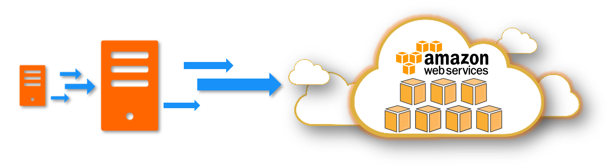
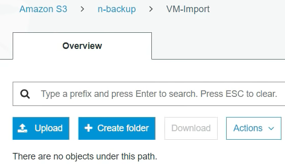
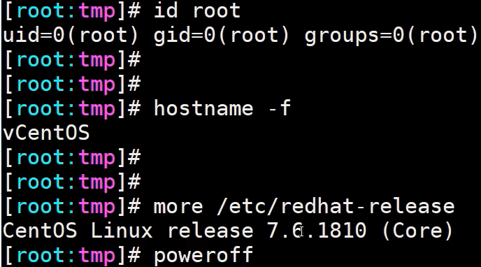
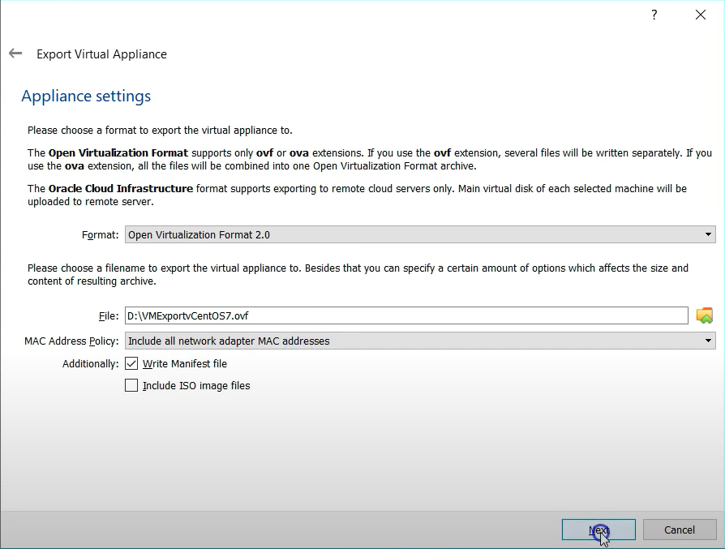
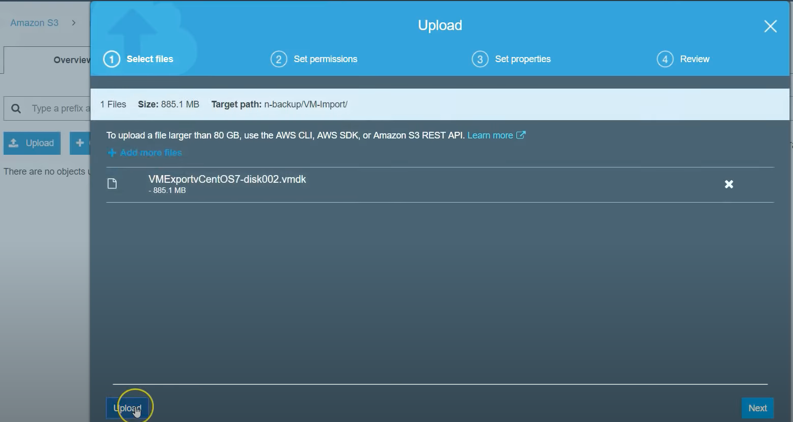
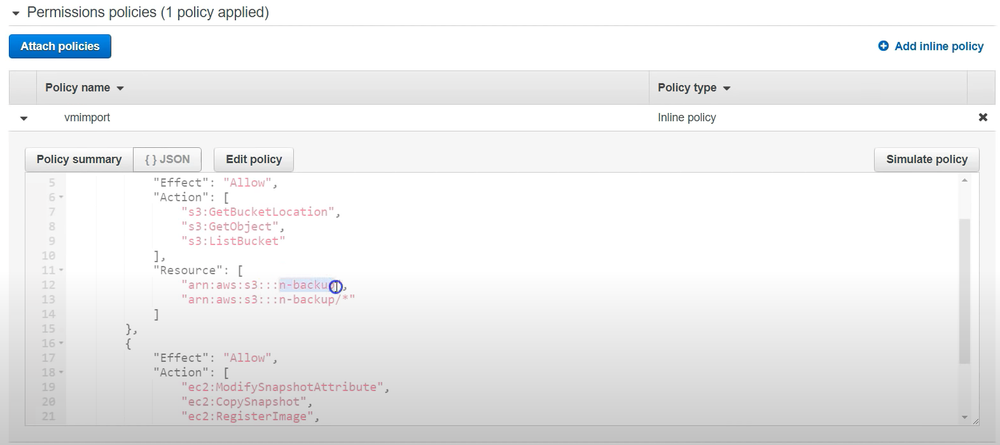
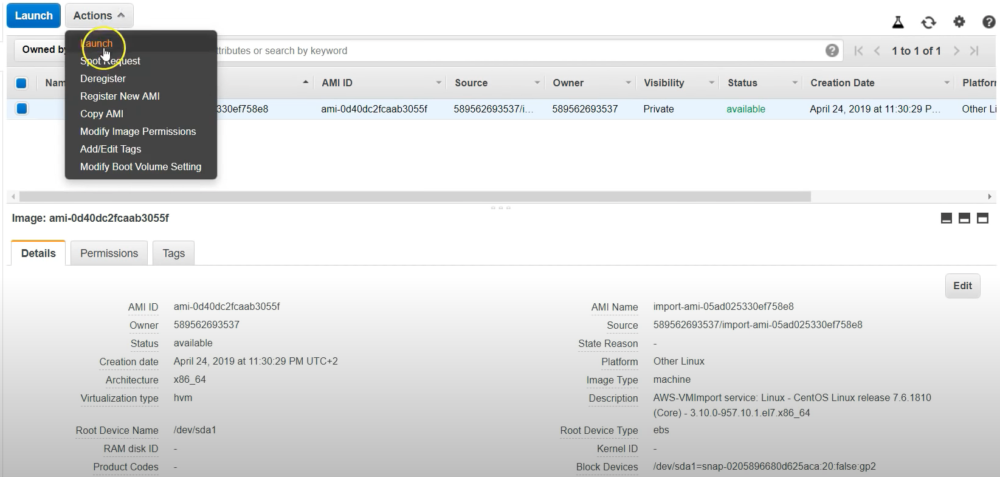
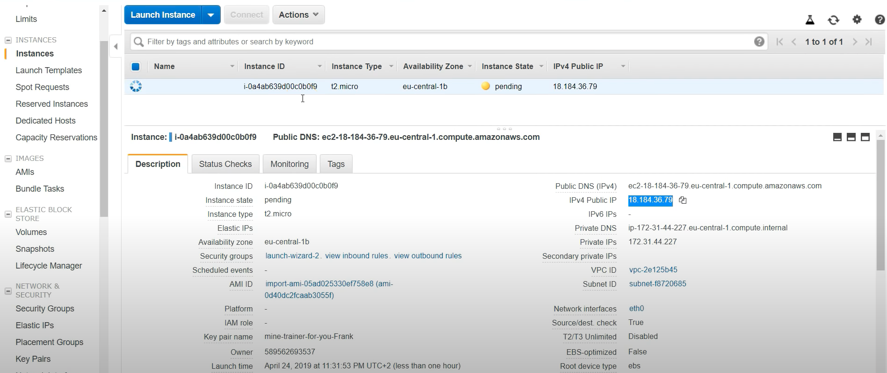
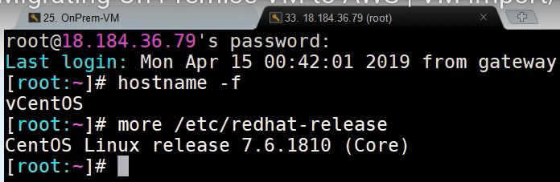

# aws-ec2-import-onpre-to-aws 💣💣💣！！！


[](https://github.com/tquangdo/aws-ec2-import-onpre-to-aws/issues/new)



1. ## reference
    [youtube](https://www.youtube.com/watch?v=buzusNljpy4)

1. ## s3
    - create bucket name=`n-backup`
    - create object name=`VM-Import`
    

1. ## on premis (Oracle VirtualBox)
    - check info & poweroff before migrate
    
    - click `export` will output `xxx.vmdk`
    

1. ## s3
    - upload `xxx.vmdk` into `n-backup/VM-Import/`
    

1. ## IAM role
    - create filename=`trust-policy.json`
    - create rolename=`vmimport`
    ```shell
    aws iam create-role --role-name vmimport --assume-role-policy-document "file://trust-policy.json"
    ```
    - create filename=`role-policy.json`
    - attach policyname: `vmimport` to IAM Role: `vmimport`
    ```shell
    aws iam put-role-policy --role-name vmimport \
                            --policy-name vmimport \
                            --policy-document "file://role-policy.json"
    ```
    - check role: `vmimport` in AWS:
    1. trusted entities=`vmie.amazonaws.com`
    2. policyname: `vmimport` has JSON as `role-policy.json`
    

1. ## migrate
    - create filename=`containers.json`
    - migrate:
    ```shell
    bucket_name="n-backup"
    # Add the appropriate S3 Prefix to the VM Image
    vm_image_name="VM-Import/xxx.vmdk"
    aws ec2 import-image --description "centosv7" --disk-containers "file://containers.json"
    ```
    - will have result with `"ImportTaskId": "import-ami-0d6db3a35d431e4e3"`
    - check status of VM import jobs, will see result `"Status": "completed"`
    ```shell
    aws ec2 describe-import-image-tasks --import-task-ids "import-ami-0d6db3a35d431e4e3"
    ->
    {
        "ImportImageTasks": [
            {
                "Architecture": "x86_64",
                "Description": "centosv7",
                "ImageId": "ami-0da97e2296167b5ca",
                "ImportTaskId": "import-ami-0d6db3a35d431e4e3",
                "LicenseType": "BYOL",
                "Platform": "Linux",
                "SnapshotDetails": [
                    {
                        "Description": "centosv7",
                        "DeviceName": "/dev/sda1",
                        "DiskImageSize": 931182592.0,
                        "Format": "VMDK",
                        "SnapshotId": "snap-0dc6d32a5924b22c7",
                        "Status": "completed",
                        "UserBucket": {
                            "S3Bucket": "n-backup",
                            "S3Key": "VM-Import/xxx.vmdk"
                        }
                    }
                ],
                "Status": "completed"
            }
        ]
    }
    ```

1. ## AMI
    - launch `import-ami-???`
    
    - will have a result migrated EC2
    

- ssh to EC2, check info is the same with before migrated

